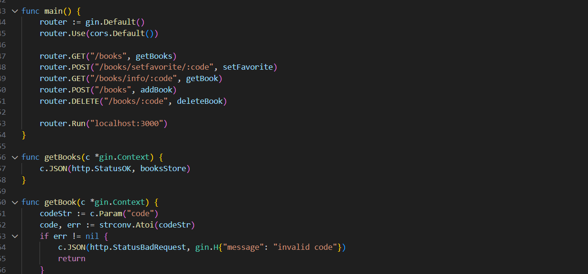
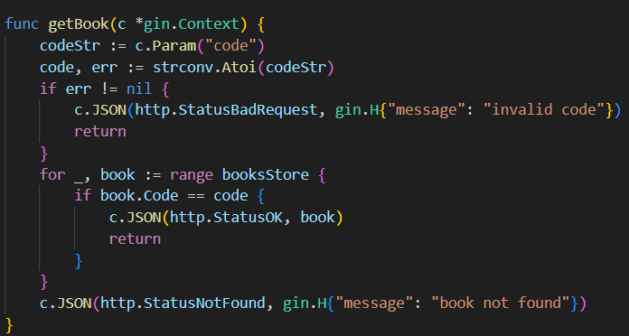
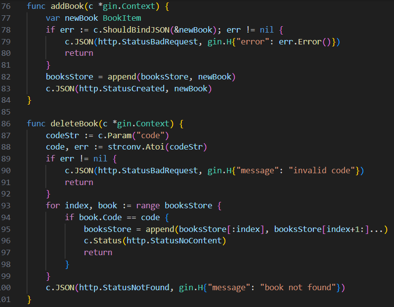
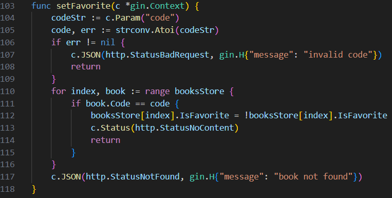

Программирование корпаративных систем

Фадеев Максим ЭФБО-02-22

Практика 8-9

Сделаны http запросы для: -Получить список книг -Добавить книгу в список -Удалить из списка -Получить список книг в корзине -Добавить в избранное -Добавить в корзину -Удалить из израбранного -Удалить из корзины -Изменение профиля -Сохранение профиля

